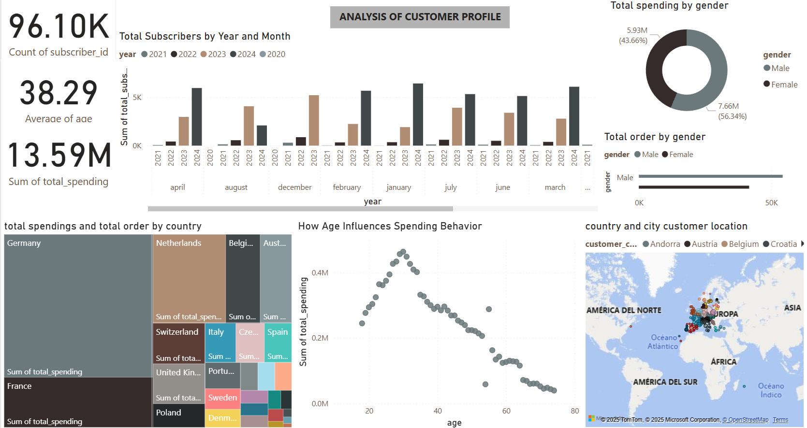
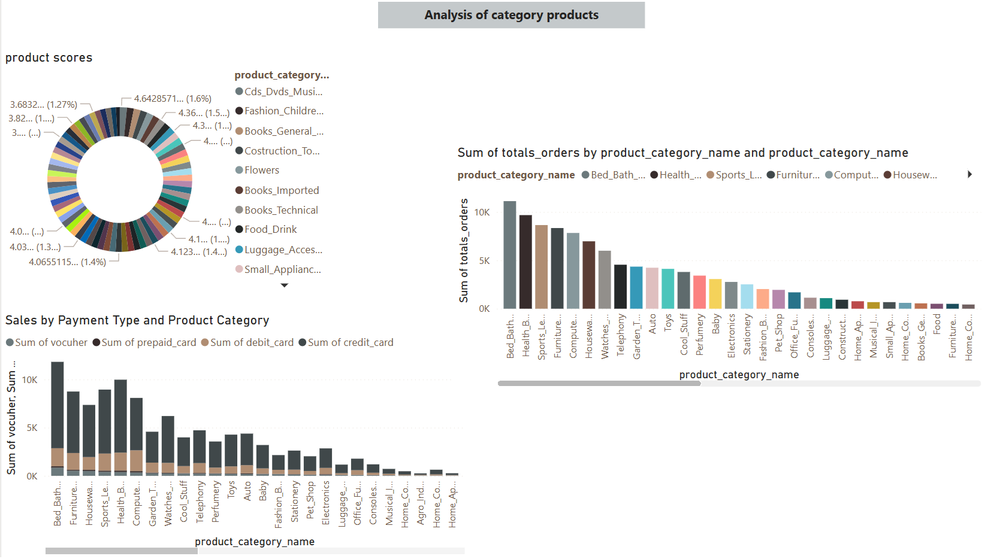
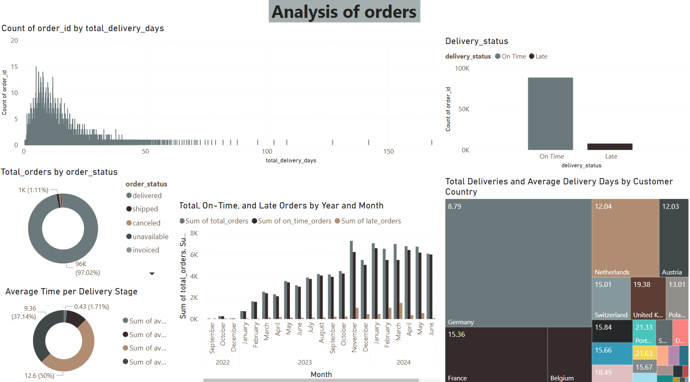
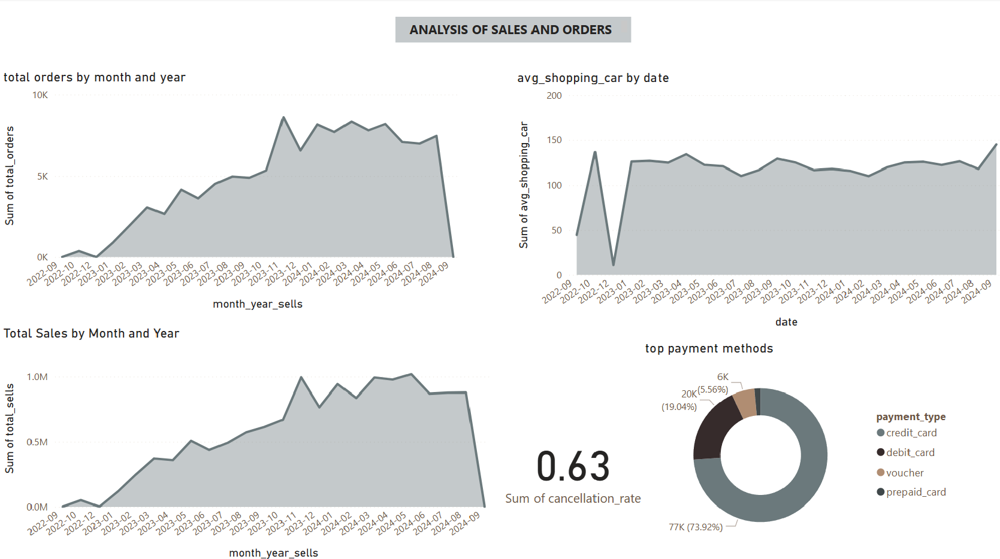
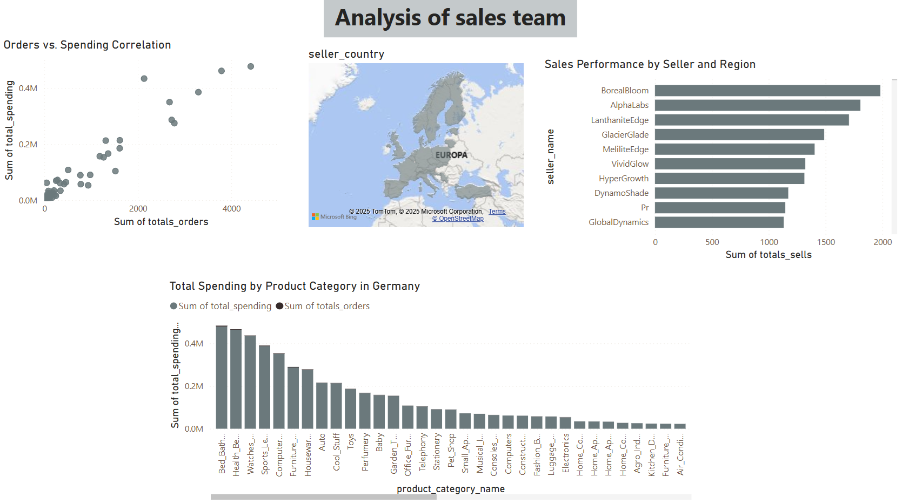

# Retail-Analysis
A extensive data analysis from a retail company Europe
## Project Diagram

## Steps
1. Data Download 
2. Database creation
3. Exploratory Data Analysis (EDA) in Jupyter Notebook
4. Data Cleaning and Transformation
5. Creation of SQL Views
## Dashboards
### Analysis of customer profile

### Analysis of category products

### Analysis of orders

### Analysis of sales and orders

### Analysis of sales team

## Useful Links
[Kaggle Dataset](https://www.kaggle.com/datasets/cemeraan/fecom-inc-e-com-marketplace-orders-data-crm)